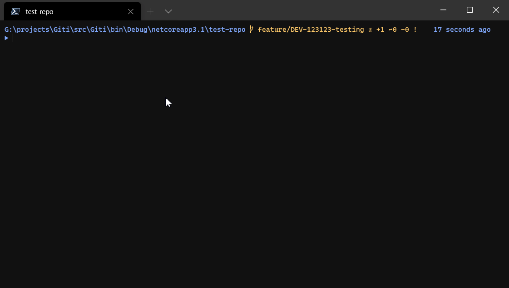

# Giti

A simple tool for customizing git commit message.

## Installation

1. [`choco install giti`][choco] (install with `--version=xxx` while the package is waiting for approval)
1. Install [`lefthook`][lefthook]
1. Navigate to a git repo
1. Run `lefthook install`
1. Run `lefthook add -d commit-msg` inside a git repo
1. Create `commit-msg.bat` under `./lefthook/commit-msg` (customize according to [Usage](#usage))

   ```batch
   @giti "%*" -t "GitHeadFriendlyName" -p "[a-zA-Z]+-\d+" -r "{{ match | string.upcase }} {{ message }}"
   ```

1. Edit `lefthook.yml` accordingly

   ```yml
    commit-msg:
    scripts:
        "commit-msg.bat":
        runner: cmd /c
   ```

> Notes:
>
> 1. A script is require to call `giti` so that `lefthook` will pass the arguments (provided by `git`) to `giti`

## Usage

```console
$ giti --help

  -t, --sourceType    (Default: GitHeadFriendlyName) The source for extraction.
                      Valid values: GitHeadFriendlyName, GitHeadCanonicalName

  -p, --pattern       Required. The regex used for extraction from the source.

  -r, --template      Required. The template used for constructing the commit
                      message. Uses scriban templating engine.

  --help              Display this help screen.

  --version           Display version information.

  value pos. 0        Path to the COMMIT_EDITMSG file (provided by git).
```

## Demo

Configuration:

```
@giti "%*" -t "GitHeadFriendlyName" -p "[a-zA-Z]+-\d+" -r "{{ match | string.upcase }} {{ message }}"
```

This will extract ticket number from the `HEAD`'s branch name, convert it to uppercase, and prepend it to the final commit message.




[choco]: https://chocolatey.org/packages/giti/
[lefthook]: https://github.com/Arkweid/lefthook